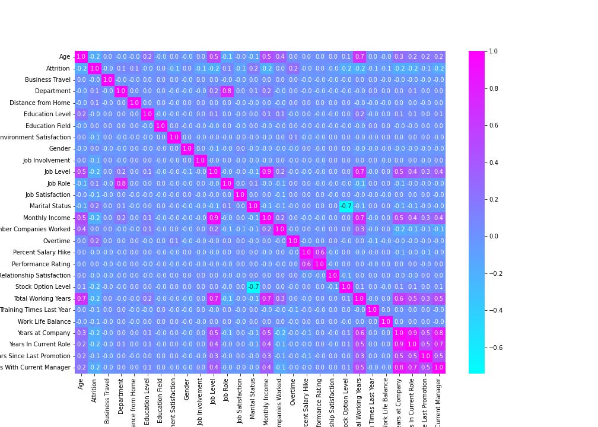
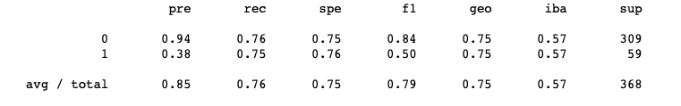
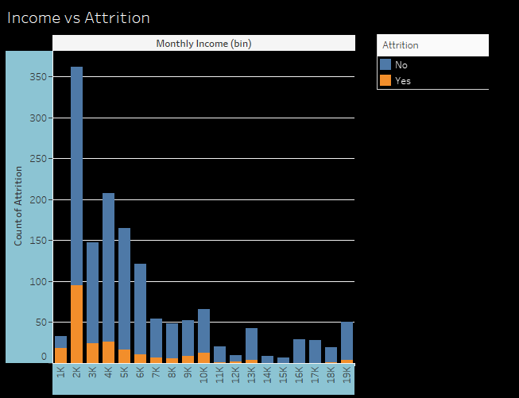
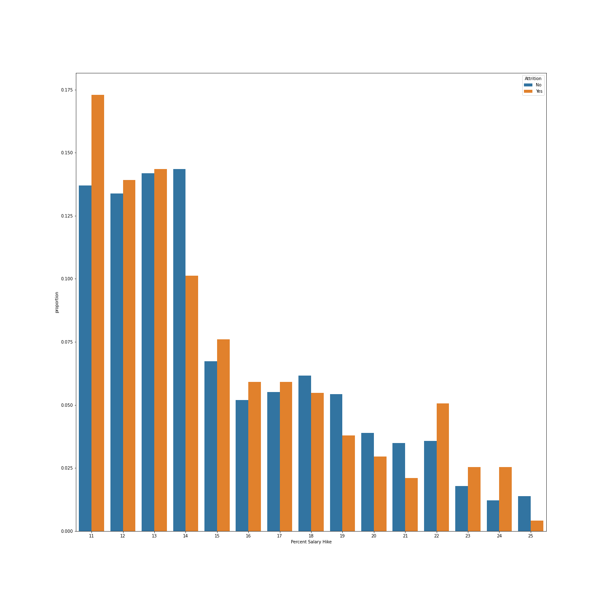
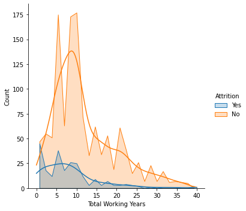
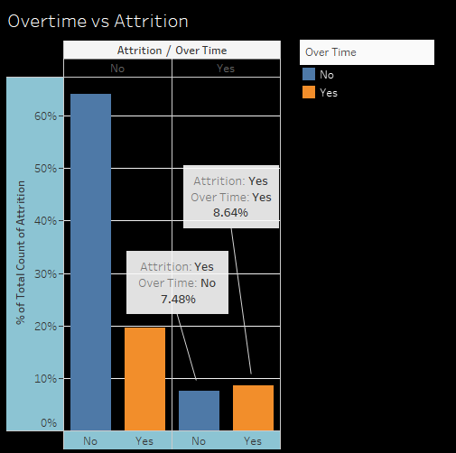

# The Tale of Flight Risk & the Holy Grail of Corporate Happiness
### *Predicting Employee Attrition and Exploring it's Causes*
---
 

## Why is understanding WHEN and WHY employees quit important?

Intimately understanding employee attrition and its causes empowers organizations from any sector to retain the most skilled workers, save on costly training, and improve overall organizational culture and employee sentiment. It is also symbiotic, which is one of the biggest testaments of whether a system is successful and will last.  Focusing on employee retention benefits not only the organization’s success and longevity, but also the employees, so the system continues to feed itself.  And employee attrition affects EVERY industry.

According to the Work Institute, most of the cost of employee churn comes from hidden or “soft” costs, such as loss of productivity, knowledge, and time.  Trading out one employee for another is not an even trade.  As you can see in the graph below, there is a significant amount of time where money is being lost before a new hire starts to produce a return for the company and an even longer time before they can get to the level of engagement and productivity of the employee whose shoes they are filling.
 
 

When an organization loses an employee, this equates to approximately 1.5 – 2x the previous employee’s annual salary in hard costs.  Money that could have gone into keeping the employee happy and retaining them. For hourly workers, approximately $1,500, and estimates range based on the type of position and seniority.

One must consider all the hard and soft costs of failing to retain valuable employees.  During the hiring process, there are costs involved with advertising job openings, interviewing and screening, time and training during onboarding, and loss of productivity, as a new person may take 1-2 years to reach the productivity of the previous employee.  Loss of business, as the new employees are less adept at problem-solving and responding to issues, and may actually not even end up being a good fit for the company. Cultural impact.  Whenever someone leaves, others inherently ask why, and no one wants to go down with a sinking ship.  And the stress of understaffing can result in burnout. 
 
 

If employers were able to make an educated guess at predicting when their current employees might quit and why they may be able to intervene in time.
 
 

## Project Overview

For our project, we created and tested a few different machine learning models to predict whether an employee is likely to quit based on various features, then deployed the model to be used by employers on our website.  We continued to explore the data based on the most highly weighted features, as determined by our random forest model’s feature importance classification.  Data exploration began with SQL queries, but visualizations developed in Tableau and from Python's Seaborn provided the most insight into our data's attrition trends, which can be used to assist organizations with developing possible solutions. 

Our analysis and predictions can assist employers with getting to the root of employee grievances and what makes them stay, guide management on timing for engagement with their employees, raises or role restructuring, and improve the workplace environment for the employees. 
 
 

## Data Cleaning and Preparing For Machine Learning
The data came to us quite clean and not very many actions were needed to clean it. Columns with ambiguously explained data, unique identifiers, and data with values that were the same throughout each row were dropped. 

To prepare the data for machine learning, the categorical data was first encoded using one hot encoding. We later went back and re-encoded the data using label encoding, to increase aesthetics and ease for webpage deployment.  There was evidence of multicollinearity, which is when two or more of the features are highly correlated to each other. To address this issue, four more columns were dropped. The non-encoded columns were then standardized.

 
 

## Machine Learning

Three machine learning models were created, tested and optimized to determine the best fit for our website deployment: Logistic Regression, Random Forest and Neural Network models:
 
 

### Logistic Regression Model

The purpose of the model was to predict whether an employee will stay or leave their current job given various demographics, HR information and answers to questionairres.  The model predicted at 75.47% accuracy. The classification report is below:

### Random Forest

We used this model because it is good for binary classification, and for it's ability to determine feature importance, which we planned to use to guide our exploratory analysis. It ended up with an 84% accuracy, but due to the high number of false negatives, we did not end up using this model.
The classification report, confusion matrix and feature importance can be seen below:

### Neural Network
The Neural network we ended with used two layers, as well as an ouput layer. The Keras sequential model was used, along with three layers using the sigmoid activation function, as it is best for binary classification. The model ended with a 87.41% accuracy and with a loss of 1.97, so it performed extremely well. However, given it was completed late in the process, we were unable to get the breakdown of false positives and negatives.  We did not go with this model for use on our website.

The absense of false negatives were important to us in this case, because we wanted to ensure no employees were slipping through the cracks.  We chose to utilize our linear regression model due to it's performance in terms of model sensitivity (i.e. it's ability to catch all true 1s).
 
 

## Dashboard

We decided on which features to eliminate for the website by determining feature importance from the random forest model, ruling out features that beared less weight on the models, and by ascertaining features most influenced by multiculinearity. We reduced the features to 23 in total for the app, which also increased the likelihood of a user filling out the form in its entirety. We decided to utilize the logistic regression model out of the three tested models, because it contained the least amount of false negative values during training and testing. The model is then saved and loaded into the app through serialization and de-serialization. 

A key is provided to the user so that every input is numerical. Placeholders within each textbox are values of the first row of the dataset and are set as an example for the user. Eash field is required so that any missing input will be pointed out to the user and the result will not be posted to the server until every textbox is filled. The model utilizes user input to calculate the probability of an employee staying compared to leaving and returns the more probable result.

Example result

 
 

## Exploratory Data Analysis
One of the first things we noticed about our data, was that it was compromised of mostly two different categories: work-related features, meaning factors that the organization could manage or adjust, and personal features, that the organization has no control over, such as age or marital status.  Based on the random forest’s feature importance classifications, we decided to dig deeper into the top 6 highly weighted features, and a few of their correlated features.

Our random forest model's feature importance classification determined income, age, whether an employee was working overtime, their years at the company, the employee's total working years, and their distance from home to work to be the most heavily weighted or important features in predicting attrition.

We considered which features were in control of the organization and debated whether to include exploration of age and total working years, but due to the way those features interplayed with other features, and findings from external data that note how an employee's needs may change based on age, we decided to further explore all of the top six important features and a few additional visualizations to show a more complete story of the data. Using Python's Seaborn library and Tableau, trends about the data were uncovered:
 
 

### Income vs. Attrition

 
 

### Percent Salary Hike vs. Attrition

### Age Vs. Attrition

### Total Working Years vs. Attrition

 
 

### Number of Companies Worked For vs. Attrition

### Years at Company vs. Attrition

### Overtime vs. Attrition

 
 

### Distance From Home vs. Attrition

 
 

## Findings
Not shockingly, our data shows that employees who made the highest income had the lowest numbers of attrition.  C.R.E.A.M.  However, as you can see in the visualization above, though the majority of the those who quit were in the lower income ranges, majority of all employees fall within the lower monthly income ranges, whether they quit or not.  For example, the $2,000 monthly income bin has the highest count of attrition at 95, but this accounts for only 17% of all employees in the $2,000 montly income bin.  

This demonstrates a potential outside influence that does not accurately portray the trend of more income = less quitting, at least not for truly understanding the reason for quitting. Furthermore, those who have been with the company longer are likely older, more senior, and likely make more money becuase of this, so the income feature may have been pulled in a similar direction to age, number of working years, or years with company for any of those confounding reasons. We noticed some interesting income patterns when comparing with outside data.

Life satisfaction and experienced well-being appear to momentarily plateau around the $75,000 annual salary mark.  

(Discuss importance of employee engagement)
(Discuss overtime and Distance from Home.)

We found that younger employees and employees and closer to the start of their career were more likley to leave their job, likely to leave to pursue other opportunities in the beginning their careers. (Discuss findings of visualizations more in depth).

While attrition is a problem that effects every industry, use of our predictive models and findings are most helpful for large-scale organizations, where individual sentiment often flies under the radar and employees fall through the cracks.
 
 

## Considerations For Further Development
Since the current data is restricted to information from approximately 1,400 individuals in the technological industry, we felt a bit limited by our data.  We would like to bring in more data to improve the models and open up predictions to other fields of work and features.  Employee needs and wants can often change between industries, and generally the more data, the better.  We would like to fine tune the usability of the website versus the machine learning accurancy, since we had to make some sacrifices on both ends for the greater good of the entire project (i.e. balancing accuracy of model and aesthetics/usability of website).  Futher assessing and spending more time working with these trade offs could result in an even better model and website.   

We would like to introduce qualitative research and data to further expand the employee and management perspective.  There is only so much information that can be gained with data trends.  Dicovering and explaining some of the nuances helps with true understanding and hence properly guided solutions, and helps to avoid being persuaded by potential outliers in the decision making process.  

Configure a timing element for intervention via the website - ex: gathering month of hire and month of attrition via additional data
Use of our predictive models and findings are most helpful for large-scale organizations
 
 

### Resources
- Data source: 
    - IBM_employee_data.csv (located in the "resources" folder)
- Software: 
    - Jupyter Notebook 6.4.6
    - pgAdmin 11.14
    - Amazon Web Service - RDS 
    - VS Code 1.68.0
    - Tableau Public 2022.1
    - Google Slides
    
### Citations

1) *Experienced well-being rises with income, even above $75,000 per year*, pnas.org; Matthew A. Killingsworth, Published November 14, 2020.
2) *How Employee Engagement Drives Growth*, gallup.com; Susan Sorenson, Published June 20th, 2013.
3) *Remote Workers Report More Job Unhappiness, Especially Gen Z*, civicscience.com; Danielle Commisso; Published February 8, 2022. 
4) *Employee Retention Now a Big Issue: Why the Tide has Turned*, linkedin.com; Josh Bersin; Published on August 16, 2013.
5) *To Have and to Hold: Amid one of the tightest labor markets in the past 50 years, employee retention is more critical than ever*, shrm.org; Theresa Agovino; Published February 23, 2019.

### Link to Presentation Slides
https://docs.google.com/presentation/d/1GCnuq3QFD7YBTuNLOd9c_YpS5zzCBbDL3zUX_teldi0/edit?usp=sharing
